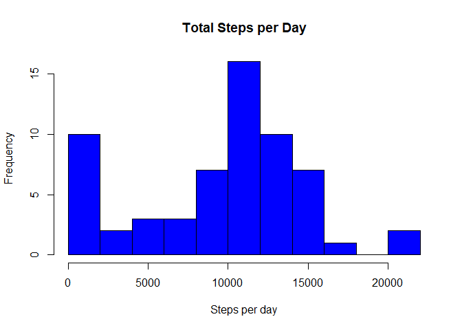
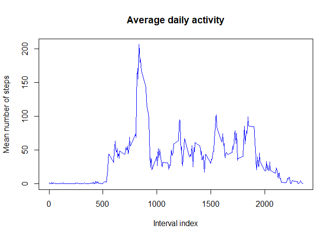
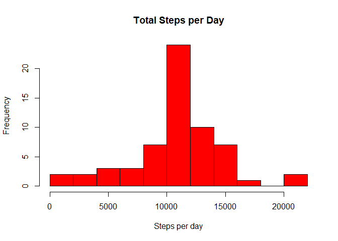
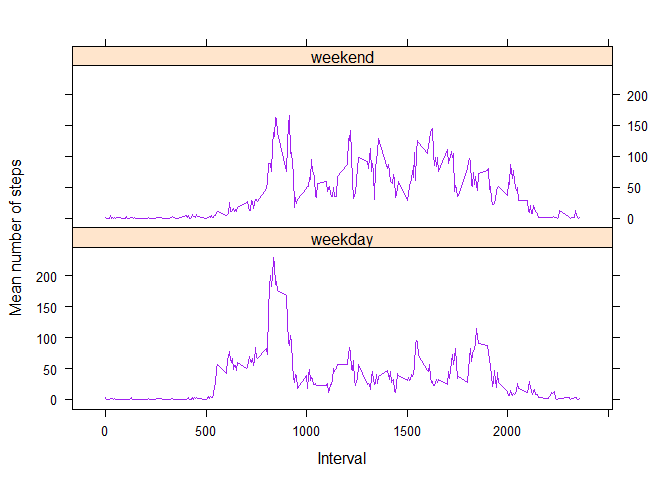

Reproducible Research - Week 2 Assignment
================
Benjamin Partridge
March 13, 2018

Loading and processing the data
-------------------------------

The data are included in a \*.csv file within a \*.zip archive. This zip archive is first unzipped and the resultant csv file loaded:

``` r
unzip("activity.zip")
activityData <- read.csv("activity.csv")
```

We can look at the structure of the data using the str() function;

``` r
str(activityData)
```

    ## 'data.frame':    17568 obs. of  3 variables:
    ##  $ steps   : int  NA NA NA NA NA NA NA NA NA NA ...
    ##  $ date    : Factor w/ 61 levels "2012-10-01","2012-10-02",..: 1 1 1 1 1 1 1 1 1 1 ...
    ##  $ interval: int  0 5 10 15 20 25 30 35 40 45 ...

We can see that the date column has been loaded as a column of factors. This must be corrected:

``` r
activityData$date <- as.Date(activityData$date)
str(activityData)
```

    ## 'data.frame':    17568 obs. of  3 variables:
    ##  $ steps   : int  NA NA NA NA NA NA NA NA NA NA ...
    ##  $ date    : Date, format: "2012-10-01" "2012-10-01" ...
    ##  $ interval: int  0 5 10 15 20 25 30 35 40 45 ...

What is the mean total number of steps taken in a day?
------------------------------------------------------

We'll use the *dplyr* package to summarize the data. First we need to group the data by date:

``` r
library(dplyr)
```

    ## 
    ## Attaching package: 'dplyr'

    ## The following objects are masked from 'package:stats':
    ## 
    ##     filter, lag

    ## The following objects are masked from 'package:base':
    ## 
    ##     intersect, setdiff, setequal, union

``` r
by_date <- group_by(activityData, activityData$date)
```

Then we can evaluate the sum of the steps taken, per day, ignoring all missing values:

``` r
stepsperday <- summarize(by_date, sum(steps, na.rm=TRUE))
print(stepsperday, n = 61)
```

    ## # A tibble: 61 x 2
    ##    `activityData$date` `sum(steps, na.rm = TRUE)`
    ##    <date>                                   <int>
    ##  1 2012-10-01                                   0
    ##  2 2012-10-02                                 126
    ##  3 2012-10-03                               11352
    ##  4 2012-10-04                               12116
    ##  5 2012-10-05                               13294
    ##  6 2012-10-06                               15420
    ##  7 2012-10-07                               11015
    ##  8 2012-10-08                                   0
    ##  9 2012-10-09                               12811
    ## 10 2012-10-10                                9900
    ## 11 2012-10-11                               10304
    ## 12 2012-10-12                               17382
    ## 13 2012-10-13                               12426
    ## 14 2012-10-14                               15098
    ## 15 2012-10-15                               10139
    ## 16 2012-10-16                               15084
    ## 17 2012-10-17                               13452
    ## 18 2012-10-18                               10056
    ## 19 2012-10-19                               11829
    ## 20 2012-10-20                               10395
    ## 21 2012-10-21                                8821
    ## 22 2012-10-22                               13460
    ## 23 2012-10-23                                8918
    ## 24 2012-10-24                                8355
    ## 25 2012-10-25                                2492
    ## 26 2012-10-26                                6778
    ## 27 2012-10-27                               10119
    ## 28 2012-10-28                               11458
    ## 29 2012-10-29                                5018
    ## 30 2012-10-30                                9819
    ## 31 2012-10-31                               15414
    ## 32 2012-11-01                                   0
    ## 33 2012-11-02                               10600
    ## 34 2012-11-03                               10571
    ## 35 2012-11-04                                   0
    ## 36 2012-11-05                               10439
    ## 37 2012-11-06                                8334
    ## 38 2012-11-07                               12883
    ## 39 2012-11-08                                3219
    ## 40 2012-11-09                                   0
    ## 41 2012-11-10                                   0
    ## 42 2012-11-11                               12608
    ## 43 2012-11-12                               10765
    ## 44 2012-11-13                                7336
    ## 45 2012-11-14                                   0
    ## 46 2012-11-15                                  41
    ## 47 2012-11-16                                5441
    ## 48 2012-11-17                               14339
    ## 49 2012-11-18                               15110
    ## 50 2012-11-19                                8841
    ## 51 2012-11-20                                4472
    ## 52 2012-11-21                               12787
    ## 53 2012-11-22                               20427
    ## 54 2012-11-23                               21194
    ## 55 2012-11-24                               14478
    ## 56 2012-11-25                               11834
    ## 57 2012-11-26                               11162
    ## 58 2012-11-27                               13646
    ## 59 2012-11-28                               10183
    ## 60 2012-11-29                                7047
    ## 61 2012-11-30                                   0

Next we will produce a histogram.

``` r
hist(stepsperday$`sum(steps, na.rm = TRUE)`,
     xlab = "Steps per day",
     main = "Total Steps per Day",
     breaks = 10,
     col = "blue")
```



We see that the subject walks between 10,000 and 12,000 steps on the highest number of days. To calculate the mean and median number of steps walked per day, we can call the summary() function:

``` r
summary(stepsperday$`sum(steps, na.rm = TRUE)`)
```

    ##    Min. 1st Qu.  Median    Mean 3rd Qu.    Max. 
    ##       0    6778   10395    9354   12811   21194

From which we see that the mean number of steps per day is 9,354, and the median number of steps per day is 10,395.

What is the average daily activity pattern?
-------------------------------------------

We would like to plot the average activity of the subject as a function of time period during the day. First we need to group the data by interval during the day, just as we did previously by date:

``` r
by_interval <- group_by(activityData, activityData$interval)
```

Then we can evaluate the average number of steps taken, per interval during the day, ignoring all missing values:

``` r
stepsperinterval <- summarize(by_interval, mean(steps, na.rm=TRUE))
```

Finally we produce a time series plot to visualize the subject's activity during the day:

``` r
plot(stepsperinterval,
     type = "l",
     xlab = "Interval index",
     ylab = "Mean number of steps",
     main = "Average daily activity",
     col = "blue")
```



We can then look up which interval has the maximum number of steps:

``` r
max <- max(stepsperinterval$`mean(steps, na.rm = TRUE)`)          ## Determine the max value of steps
index <- grep(max, stepsperinterval$`mean(steps, na.rm = TRUE)`)  ## Find row number containing max value
stepsperinterval[index,]                                          ## Read row containing max value
```

    ## # A tibble: 1 x 2
    ##   `activityData$interval` `mean(steps, na.rm = TRUE)`
    ##                     <int>                       <dbl>
    ## 1                     835                        206.

Therefore we see that the most active interval (on average) was interval 835, with an average of 206 steps during that interval.

Imputing missing values
-----------------------

To count the number of missing values, we can generate a logical vector of whether each value is NA or not, and then take the sum of that vector (given that TRUE = 1 and FALSE = 0):

``` r
sum(is.na(activityData$steps))
```

    ## [1] 2304

There are therefore 2304 missing values in the 'steps' variable.

Let's replace each missing value with the mean number of steps for the corresponding interval, as determined previously.

``` r
for (i in 1:nrow(activityData)) {
      if (is.na(activityData[i,1] == TRUE)) {
                  activityData[i,1] <- stepsperinterval[stepsperinterval$`activityData$interval` == activityData$interval[i],2]
      }
}
```

We can again evaluate the number of missing values:

``` r
sum(is.na(activityData$steps))
```

    ## [1] 0

As desired, there are no missing values remaining in the dataset. We will again plot a histogram of the number of steps taken each day, first by grouping the data by day, and then by summarizing the number of steps per day. The code used here is the same as previously:

``` r
by_date <- group_by(activityData, activityData$date)
stepsperday <- summarize(by_date, sum(steps, na.rm=TRUE))
hist(stepsperday$`sum(steps, na.rm = TRUE)`,
     xlab = "Steps per day",
     main = "Total Steps per Day",
     breaks = 10,
     col = "red")
```



To calculate the mean and median number of steps walked per day, we again call the summary() function:

``` r
summary(stepsperday$`sum(steps, na.rm = TRUE)`)
```

    ##    Min. 1st Qu.  Median    Mean 3rd Qu.    Max. 
    ##      41    9819   10766   10766   12811   21194

From which we see that the mean number of steps per day is 10,766, and the median number of steps per day is 10,766. (Without missing values, these figures were mean = 9,354 and median = 10,395.) Imputing missing values increases both the mean and the median numbers of steps.

Are there differences in activity patterns between weekdays and weekends?
-------------------------------------------------------------------------

To look for weekday and weekend trends, we first need to categorize the data as 'weekend' and 'weekday':

``` r
weekdays1 <- c("Monday","Tuesday","Wednesday","Thursday","Friday")

for (i in 1:nrow(activityData)) {
      if (weekdays(activityData$date[i]) %in% weekdays1) { 
            activityData$day[i] <- "weekday"
      }
      else {
            activityData$day[i] <- "weekend"
      }
}

activityData$day <- as.factor(activityData$day)

str(activityData)
```

    ## 'data.frame':    17568 obs. of  4 variables:
    ##  $ steps   : num  1.717 0.3396 0.1321 0.1509 0.0755 ...
    ##  $ date    : Date, format: "2012-10-01" "2012-10-01" ...
    ##  $ interval: int  0 5 10 15 20 25 30 35 40 45 ...
    ##  $ day     : Factor w/ 2 levels "weekday","weekend": 1 1 1 1 1 1 1 1 1 1 ...

We can see from the above str() result that the 'day' variable has coded each observation as weekday or weekend.

Next we want to evaluate the average number of steps taken, per interval during the day:

``` r
by_interval <- group_by(activityData, activityData$interval, activityData$day)
stepsperinterval <- summarize(by_interval, mean(steps, na.rm=TRUE))
stepsperinterval
```

    ## # A tibble: 576 x 3
    ## # Groups:   activityData$interval [?]
    ##    `activityData$interval` `activityData$day` `mean(steps, na.rm = TRUE)`
    ##                      <int> <fct>                                    <dbl>
    ##  1                       0 weekday                                2.25   
    ##  2                       0 weekend                                0.215  
    ##  3                       5 weekday                                0.445  
    ##  4                       5 weekend                                0.0425 
    ##  5                      10 weekday                                0.173  
    ##  6                      10 weekend                                0.0165 
    ##  7                      15 weekday                                0.198  
    ##  8                      15 weekend                                0.0189 
    ##  9                      20 weekday                                0.0990 
    ## 10                      20 weekend                                0.00943
    ## # ... with 566 more rows

Finally we produce a time series plot to visualize the subject's average activity during weekends and weekdays:

``` r
library(lattice)
factors <- as.factor(c("weekday", "weekend"))
xyplot(
      `mean(steps, na.rm = TRUE)` ~ `activityData$interval` | factors,
      data = stepsperinterval,
      layout = c(1,2),
      xlab = "Interval",
      ylab = "Mean number of steps",
      type = "l",
      col = "purple"
)
```


